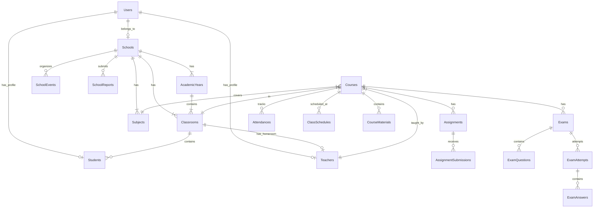

# Database Schema Documentation

This document provides a detailed overview of the database schema for the LMS Project.

## Overview

The database is designed to support a multi-tenant-like structure schools, managing academic years, users (students, teachers, admins), and learning activities (courses, assignments, exams).

### Core Entities

#### Users Table (`users`)

Stores authentication details for all users.
| Column | Type | Description |
|--------|------|-------------|
| id | bigInteger | Primary Key |
| name | string | Full name |
| email | string | Unique email address |
| password | string | Hashed password |
| role | enum | `kepala_sekolah`, `guru`, `siswa`, `orang_tua`, `dinas` |
| school_id | foreignId | FK to `schools`. Nullable (e.g. for superadmins/dinas) |
| phone_number | string | Optional contact number |
| timestamps | timestamp | Created & Updated at |

#### Schools Table (`schools`)

Stores school profiles.
| Column | Type | Description |
|--------|------|-------------|
| id | bigInteger | Primary Key |
| npsn | string | Unique school identification number |
| name | string | School name |
| education_level | string | Level (SD, SMP, SMA, etc.) |
| status | enum | `pending`, `active`, `rejected`, etc. |
| address_details | string | Multiple columns (address, district, village) |
| timestamps | timestamp | |

### Academic Structure

#### Academic Years (`academic_years`)

Defines the academic calendar.
| Column | Type | Description |
|--------|------|-------------|
| id | bigInteger | Primary Key |
| school_id | foreignId | FK to `schools` |
| name | string | Year name (e.g., "2024/2025") |
| semester | enum | `ganjil`, `genap` |
| is_active | boolean | Indicates the current active year |
| timestamps | timestamp | |

#### Classrooms (`classrooms`)

Represents a class group (Rombel).
| Column | Type | Description |
|--------|------|-------------|
| id | bigInteger | Primary Key |
| school_id | foreignId | FK to `schools` |
| academic_year_id | foreignId | FK to `academic_years` |
| name | string | Class name (e.g., "X-IPA-1") |
| grade_level | integer | Numeric grade level |
| teacher_id | foreignId | FK to `teachers` (Homeroom teacher / Wali Kelas) |
| timestamps | timestamp | |

#### Subjects (`subjects`)

Master data for subjects taught in the school.
| Column | Type | Description |
|--------|------|-------------|
| id | bigInteger | Primary Key |
| school_id | foreignId | FK to `schools` |
| name | string | Subject name |
| code | string | Subject code |
| timestamps | timestamp | |

### Profiles

#### Students (`students`)

Extended profile for student users.
| Column | Type | Description |
|--------|------|-------------|
| id | bigInteger | Primary Key |
| user_id | foreignId | FK to `users` |
| school_id | foreignId | FK to `schools` |
| classroom_id | foreignId | FK to `classrooms` |
| nis | string | Student ID |
| nisn | string | National Student ID |
| date_of_birth | date | |
| timestamps | timestamp | |

#### Teachers (`teachers`)

Extended profile for teacher users.
| Column | Type | Description |
|--------|------|-------------|
| id | bigInteger | Primary Key |
| user_id | foreignId | FK to `users` |
| school_id | foreignId | FK to `schools` |
| nip | string | Employee ID |
| specialization | string | Main subject expertise |
| timestamps | timestamp | |

### Learning Management (Courses)

#### Courses (`courses`)

The central pivot table linking `Subject`, `Classroom`, and `Teacher`. Use this for checking "Who teaches What in Which Class".
| Column | Type | Description |
|--------|------|-------------|
| id | bigInteger | Primary Key |
| school_id | foreignId | FK to `schools` |
| academic_year_id | foreignId | FK to `academic_years` |
| classroom_id | foreignId | FK to `classrooms` |
| subject_id | foreignId | FK to `subjects` |
| teacher_id | foreignId | FK to `teachers` |
| timestamps | timestamp | |

### Schedules & Activities

#### Class Schedules (`class_schedules`)

Weekly schedule entries for courses.
| Column | Type | Description |
|--------|------|-------------|
| id | bigInteger | Primary Key |
| school_id | foreignId | FK to `schools` |
| course_id | foreignId | FK to `courses` |
| day_of_week | enum | mon-sun |
| start_time | time | |
| end_time | time | |
| timestamps | timestamp | |

#### School Time Settings (`school_time_settings`)

Defines the bell schedule (periods) for a school.
| Column | Type | Description |
|--------|------|-------------|
| id | bigInteger | Primary Key |
| school_id | foreignId | FK to `schools` |
| day_of_week | enum | mon-sun |
| period_number | integer | 1, 2, 3... (Null for breaks) |
| label | string | e.g. "Jam 1", "Istirahat" |
| start_time | time | |
| end_time | time | |
| timestamps | timestamp | |

#### Assignments (`assignments`)

| Column      | Type       | Description     |
| ----------- | ---------- | --------------- |
| id          | bigInteger | Primary Key     |
| course_id   | foreignId  | FK to `courses` |
| title       | string     |                 |
| description | text       |                 |
| due_date    | datetime   |                 |
| timestamps  | timestamp  |                 |

#### Assignment Submissions (`assignment_submissions`)

| Column        | Type       | Description         |
| ------------- | ---------- | ------------------- |
| id            | bigInteger | Primary Key         |
| assignment_id | foreignId  | FK to `assignments` |
| student_id    | foreignId  | FK to `students`    |
| file_path     | string     |                     |
| score         | decimal    |                     |
| feedback      | text       |                     |
| submitted_at  | datetime   |                     |
| timestamps    | timestamp  |                     |

#### Exams (`exams`)

| Column           | Type       | Description     |
| ---------------- | ---------- | --------------- |
| id               | bigInteger | Primary Key     |
| course_id        | foreignId  | FK to `courses` |
| title            | string     |                 |
| start_time       | datetime   |                 |
| end_time         | datetime   |                 |
| duration_minutes | integer    |                 |
| is_published     | boolean    |                 |
| timestamps       | timestamp  |                 |

#### Exam Questions (`exam_questions`)

| Column         | Type       | Description                              |
| -------------- | ---------- | ---------------------------------------- |
| id             | bigInteger | Primary Key                              |
| exam_id        | foreignId  | FK to `exams`                            |
| question_type  | enum       | `multiple_choice`, `essay`, `true_false` |
| question_text  | text       |                                          |
| points         | integer    | Default 1                                |
| options        | json       | For multiple choice                      |
| correct_answer | text       |                                          |
| timestamps     | timestamp  |                                          |

#### Exam Attempts (`exam_attempts`)

| Column      | Type       | Description      |
| ----------- | ---------- | ---------------- |
| id          | bigInteger | Primary Key      |
| exam_id     | foreignId  | FK to `exams`    |
| student_id  | foreignId  | FK to `students` |
| started_at  | datetime   |                  |
| finished_at | datetime   |                  |
| total_score | decimal    |                  |
| timestamps  | timestamp  |                  |

#### Exam Answers (`exam_answers`)

| Column           | Type       | Description            |
| ---------------- | ---------- | ---------------------- |
| id               | bigInteger | Primary Key            |
| exam_attempt_id  | foreignId  | FK to `exam_attempts`  |
| exam_question_id | foreignId  | FK to `exam_questions` |
| answer           | text       |                        |
| score            | decimal    |                        |
| timestamps       | timestamp  |                        |

#### Attendances (`attendances`)

| Column     | Type       | Description                               |
| ---------- | ---------- | ----------------------------------------- |
| id         | bigInteger | Primary Key                               |
| course_id  | foreignId  | FK to `courses`                           |
| student_id | foreignId  | FK to `students`                          |
| date       | date       |                                           |
| status     | enum       | `present`, `absent`, `sick`, `permission` |
| timestamps | timestamp  |                                           |

#### Course Materials (`course_materials`)

| Column      | Type       | Description     |
| ----------- | ---------- | --------------- |
| id          | bigInteger | Primary Key     |
| course_id   | foreignId  | FK to `courses` |
| title       | string     |                 |
| description | text       |                 |
| file_path   | string     |                 |
| file_type   | string     | e.g. pdf, ppt   |
| timestamps  | timestamp  |                 |

### School Management

#### School Events (`school_events`)

| Column     | Type       | Description                                    |
| ---------- | ---------- | ---------------------------------------------- |
| id         | bigInteger | Primary Key                                    |
| school_id  | foreignId  | FK to `schools`                                |
| title      | string     |                                                |
| start_date | datetime   |                                                |
| end_date   | datetime   |                                                |
| type       | enum       | `holiday`, `exam`, `event`, `meeting`, `other` |
| is_holiday | boolean    |                                                |
| timestamps | timestamp  |                                                |

#### School Reports (`school_reports`)

| Column           | Type       | Description                           |
| ---------------- | ---------- | ------------------------------------- |
| id               | bigInteger | Primary Key                           |
| school_id        | foreignId  | FK to `schools`                       |
| academic_year_id | foreignId  | FK to `academic_years`                |
| uploaded_by      | foreignId  | FK to `users`                         |
| reviewed_by      | foreignId  | FK to `users`                         |
| title            | string     |                                       |
| report_type      | enum       | `Bulanan`, `Semester`, `Tahunan`, ... |
| status           | enum       | `submitted`, `reviewed`, ...          |
| file_path        | string     |                                       |
| timestamps       | timestamp  |                                       |

---

## Relationship Diagram (Simplified)

